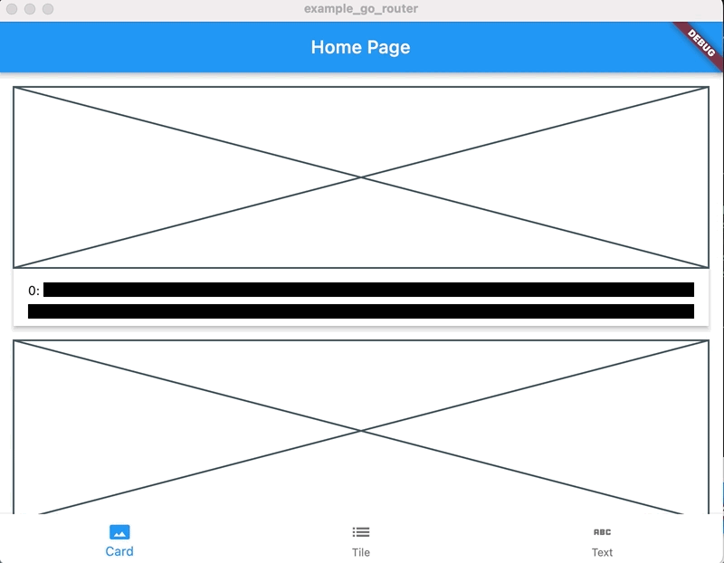

<!-- jpl-fork-notice -->
> ### 🛡️ Fork — Jeff Peiffer Legacy (`jpl_`)
> Este paquete (`jpl_example_go_router`) es un **fork** de [`example_go_router`](https://github.com/peiffer-innovations/example_go_router), originalmente creado por Jeff Peiffer y **archivado** (read-only) junto con toda la org [`peiffer-innovations`](https://github.com/peiffer-innovations).
>
> El prefijo **`jpl_`** significa **Jeff Peiffer Legacy**: mantenemos vivo el legado de estos paquetes, bumpeados a las últimas versiones de Dart/Flutter, en el monorepo `jpl`.
>
> Licencia original conservada. El crédito del diseño y la implementación original es de Jeff Peiffer.

<!-- START doctoc generated TOC please keep comment here to allow auto update -->
<!-- DON'T EDIT THIS SECTION, INSTEAD RE-RUN doctoc TO UPDATE -->
**Table of Contents**

- [example_go_router](#example_go_router)

<!-- END doctoc generated TOC please keep comment here to allow auto update -->

# example_go_router

